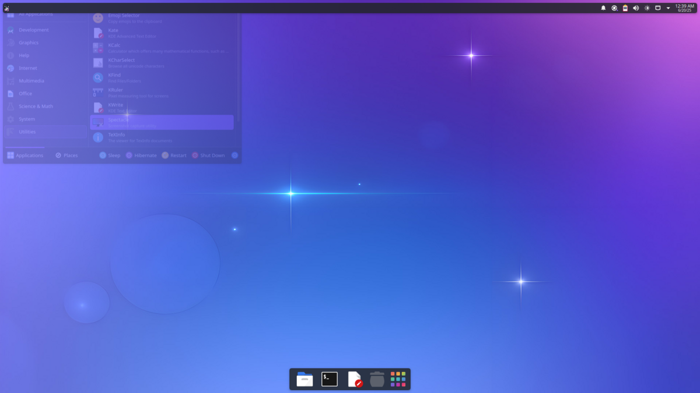

# Unicorn Commander UC-1

## About

Unicorn Commander UC-1 is a powerful, private, and modular local AI platform designed for workflow dominance and ultimate freedom. Built on Ubuntu 25.04 with a KDE6 desktop environment, it integrates a suite of best-of-breed open-source AI tools, optimized for specific hardware to deliver blazing-fast local inference and seamless AI capabilities directly within your desktop experience.

## Unleash Your Workflow with Unicorn Commander UC-1

Take command of your digital realm with Unicorn Commander UC-1, the ultimate local AI platform that puts you in control. Designed for developers, power users, and anyone seeking unparalleled privacy and performance, UC-1 transforms your mini PC into a powerhouse for artificial intelligence.

### Key Features & Capabilities:

*   **Flexible Model Execution:** Run cutting-edge AI models locally on your hardware or seamlessly integrate with major cloud providers like OpenAI, Anthropic, Gemini, Mistral, Cohere, Hugging Face, and Together.ai.
*   **Powerful, Private, Modular Design:** Experience true privacy with full local control. Your data stays with you, always. The modular hardware and software stack ensures easy upgrades and deep customization.
*   **One-Click AI & RAG Setup:** Get started instantly with simplified, one-click deployment for AI and Retrieval-Augmented Generation (RAG) capabilities.
*   **Advanced Search & Deep Search:** Find anything you need within your data with powerful, integrated search functionalities.
*   **Local Tooling & Function Servers:** Extend your capabilities by running custom tools and function servers directly on your local machine, giving you complete control over your AI ecosystem.
*   **Freedom of Choice & Control:** Switch effortlessly between blazing-fast local inference and powerful cloud-based frontier models. Connect securely to your API keys without vendor lock-in.
*   **Optimized for Performance:** Leveraging AMD Ryzen 9 8945HS CPU, integrated Radeon 780M GPU (ROCm-enabled), and a dedicated AMD Ryzen AI NPU, UC-1 is engineered for maximum efficiency and speed in AI workloads.
*   **Seamless KDE6 Integration:** Experience AI directly within your desktop environment, enhancing your productivity and creativity without leaving your familiar workspace.

### See Unicorn Commander UC-1 in Action!

Watch our introductory video to see the Unicorn Commander UC-1 platform in action and discover how it can revolutionize your workflow:

### Screenshots

---

Unicorn Commander UC-1 is a product of [Magic Unicorn Technologies](https://magicunicorn.tech).