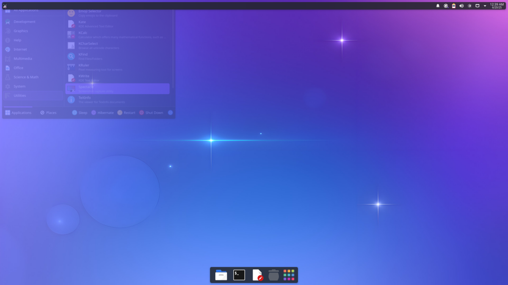

# Unicorn Commander UC-1

## About

Unicorn Commander UC-1 is a powerful, private, and modular local AI platform designed for workflow dominance and ultimate freedom. Built on **Ubuntu 25.04 (Plucky Puffin)** with a **KDE6 desktop environment**, it integrates a suite of best-of-breed open-source AI tools, optimized for specific hardware to deliver blazing-fast local inference and seamless AI capabilities directly within your desktop experience.

## Unleash Your Workflow with Unicorn Commander UC-1

Take command of your digital realm with Unicorn Commander UC-1, the ultimate local AI platform that puts you in control. Designed for developers, power users, and anyone seeking unparalleled privacy and performance, UC-1 transforms your mini PC into a powerhouse for artificial intelligence.

### Key Features & Capabilities:

*   **Flexible Model Execution:** Run cutting-edge AI models locally on your hardware or seamlessly integrate with major cloud providers like OpenAI, Anthropic, Gemini, Mistral, Cohere, Hugging Face, and Together.ai.
*   **Powerful, Private, Modular Design:** Experience true privacy with full local control. Your data stays with you, always. The modular hardware and software stack ensures easy upgrades and deep customization.
*   **One-Click AI & RAG Setup:** Get started instantly with simplified, one-click deployment for AI and Retrieval-Augmented Generation (RAG) capabilities.
*   **Advanced Search & Deep Search:** Find anything you need within your data with powerful, integrated search functionalities.
*   **Local Tooling & Function Servers:** Extend your capabilities by running custom tools and function servers directly on your local machine, giving you complete control over your AI ecosystem.
*   **Freedom of Choice & Control:** Switch effortlessly between blazing-fast local inference and powerful cloud-based frontier models. Connect securely to your API keys without vendor lock-in.
*   **Seamless KDE6 Integration:** Experience AI directly within your desktop environment, enhancing your productivity and creativity without leaving your familiar workspace.

### Hardware Specifications

Unicorn Commander UC-1 is optimized to leverage the following powerful hardware components:

*   **CPU:** **AMD Ryzen 9 8945HS** (8 Cores, 16 Threads) - Provides robust multi-threaded performance for general computing and CPU-bound AI tasks.
*   **GPU:** Integrated **AMD Radeon 780M** (gfx1103) - A highly capable integrated GPU, fully supported by **ROCm Runtime 1.15**, enabling accelerated AI workloads.
*   **NPU:** Dedicated **AMD Ryzen AI Engine** (aie2) - This Neural Processing Unit is specifically designed for highly efficient, low-power AI inference, crucial for on-device AI processing.
*   **RAM:** **48 GB DDR5 5600 MT/s** - Ample and fast memory to handle large AI models, complex datasets, and concurrent processes.
*   **Storage:** **1.8TB NVMe SSD** - Ensures rapid loading of models, quick data access, and overall system responsiveness.

### Core Docker Stack

The heart of the Unicorn Commander UC-1 platform is its robust Docker Compose stack, providing a comprehensive suite of interconnected AI services:

*   **`ollama`**: Facilitates local Large Language Model (LLM) serving, leveraging the system's GPU and NPU for accelerated inference.
*   **`open-webui`**: A user-friendly web interface for interacting with LLMs, seamlessly integrating with other services in the stack.
*   **`qdrant`**: A high-performance vector database, essential for Retrieval-Augmented Generation (RAG) capabilities.
*   **`redis`**: An in-memory data store used for caching, session management, and Pub/Sub functionalities, including WebSocket support.
*   **`postgresql`**: A powerful relational database serving as the backend for `open-webui` and other data storage needs.
*   **`unicorn-tika`**: A custom Tika OCR service for advanced document intelligence and text extraction.
*   **`unicorn-kokoro`**: A dedicated Text-to-Speech (TTS) service for voice synthesis.
*   **`unicorn-searxng`**: A self-hosted search engine, providing integrated web search capabilities within the platform.

### See Unicorn Commander UC-1 in Action!

Watch our introductory video to see the Unicorn Commander UC-1 platform in action and discover how it can revolutionize your workflow:

### Screenshots

---

Unicorn Commander UC-1 is a product of [Magic Unicorn Technologies](https://magicunicorn.tech).