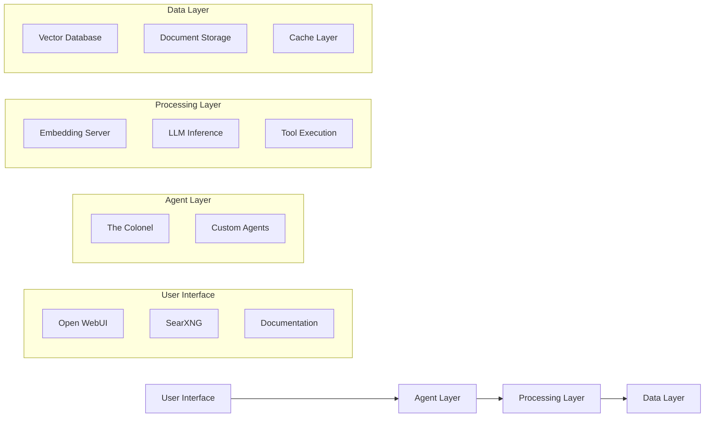

# UC-1 System Overview

## What is Unicorn Commander?

Unicorn Commander (UC) is a modular AI operating environment and automation suite for personal and enterprise use. Think of it as an AI-powered command center that lets you:

- 🧩 Spin up AI agents for business, research, content, or coding
- 📡 Automate workflows with custom pipelines
- 🚀 Run local LLMs, embeddings, RAG search, vision models, STT/TTS, and more
- 🔌 Use OpenWebUI, Open Interpreter, and other interfaces interchangeably
- 🔒 Skip the cloud. Stay in control.

## The UC-1 Difference

### 🏠 Local-First Architecture
Every component runs on your hardware. No data leaves your environment unless you explicitly configure external services.

### 🎯 Purpose-Built Hardware
The UC-1 device is specifically configured and optimized for AI workloads with:
- AMD 8945HS processor with integrated graphics acceleration
- 96GB of high-speed RAM for large model inference
- Custom Ubuntu-based OS with AI optimizations
- Pre-configured software stack

### 🔧 Enterprise Ready
- **Production Deployment**: Docker-based architecture scales from desktop to datacenter
- **Security**: Private by design, no telemetry or cloud dependencies
- **Integration**: OpenAI-compatible APIs work with existing tools
- **Customization**: Open source components allow full customization

## Core Principles

### 🧠 Radical Problem-Solving
We believe AI should amplify human capabilities, not replace human judgment. UC-1 provides powerful tools while keeping humans in control.

### 🌐 Community-Driven Development
Open source at its core, with a focus on community contributions and shared innovation.

### 🔒 Privacy by Design
Your data, your hardware, your control. No compromises.

### 🦄 Whimsy, Because Why Not?
Technology should be powerful AND fun. We embrace creativity and unconventional approaches.

## System Architecture

UC-1 follows a microservices architecture where each component serves a specific purpose:

## Target Users

### 💼 Founders & Executives
- Need AI capabilities without vendor lock-in
- Require data privacy for competitive advantage
- Want to experiment with AI safely

### 🧑‍💻 Developers & Engineers
- Building AI-powered applications
- Need local testing environments
- Want to understand AI systems deeply

### 🔬 Researchers & Scientists
- Require reproducible AI environments
- Need to process sensitive data locally
- Want to experiment with cutting-edge models

### 🏢 Enterprise IT
- Deploying AI within security constraints
- Need scalable, maintainable solutions
- Want vendor-agnostic platforms

## Success Stories

!!! example "Real-World Applications"
    - **Document Intelligence**: Process legal contracts with 99% accuracy
    - **Code Generation**: Automate repetitive development tasks
    - **Research Automation**: Analyze academic papers and generate insights
    - **Business Intelligence**: Query company data in natural language

## Getting Started

Ready to dive in? Check out our [Quick Start Guide](../installation/quick-start.md) to get UC-1 running in minutes.

For a deeper understanding, explore our [Component Documentation](../components/stack.md) to learn about each part of the system.