# UC-1 Software Stack

The UC-1 platform consists of carefully selected and integrated open-source components, each serving a specific role in the AI ecosystem.

## Architecture Overview

```mermaid
graph TB
    subgraph \"User Layer\"
        WebUI[🌐 Open WebUI<br/>Chat Interface]
        Search[🔍 SearXNG<br/>Search Engine]
        Docs[📚 Documentation<br/>MkDocs]
    end
    
    subgraph \"Agent Layer\"
        Colonel[🧠 The Colonel<br/>Automation Agent]
        Tools[🛠️ Tool Server<br/>Function Calls]
    end
    
    subgraph \"AI/ML Layer\"
        Ollama[🦙 Ollama<br/>LLM Runtime]
        Embed[🔮 Unicorn Embed<br/>Vector Generation]
        TTS[🔊 Kokoro<br/>Text-to-Speech]
        OCR[📄 Tika<br/>Document Processing]
    end
    
    subgraph \"Data Layer\"
        Vector[📊 Qdrant<br/>Vector Database]
        Cache[⚡ Redis<br/>Cache & Sessions]
        DB[🗄️ PostgreSQL<br/>Primary Database]
    end
    
    subgraph \"Infrastructure\"
        Docker[🐳 Docker<br/>Containerization]
        Network[🌐 Bridge Network<br/>Service Discovery]
        GPU[🎮 AMD GPU<br/>Vulkan Acceleration]
    end
    
    WebUI --> Colonel
    WebUI --> Embed
    WebUI --> Vector
    Colonel --> Tools
    Colonel --> Ollama
    Search --> Cache
    WebUI --> DB
    Embed --> GPU
    Ollama --> GPU
    Vector --> Cache
    
    Docker -.-> WebUI
    Docker -.-> Search
    Docker -.-> Colonel
    Docker -.-> Ollama
    Docker -.-> Vector
    Docker -.-> Cache
    Docker -.-> DB
```



## Core Components

### 🌐 Open WebUI
**Purpose**: Primary user interface for AI interactions  
**Port**: 8080  
**Image**: `ghcr.io/open-webui/open-webui:main`

#### Features:
- **Chat Interface**: ChatGPT-like conversation experience
- **Model Management**: Switch between local and remote models
- **RAG Integration**: Document upload and knowledge retrieval
- **Tool Integration**: Connect with The Colonel and other agents
- **User Management**: Multi-user support with authentication

#### Configuration:
```yaml
environment:
  OLLAMA_BASE_URL: \"http://unicorn-ollama:11434\"
  DATABASE_URL: \"postgresql://...\"
  VECTOR_DB: \"qdrant\"
  QDRANT_URI: \"http://unicorn-qdrant:6333\"
  RAG_EMBEDDING_MODEL: \"nomic-ai/nomic-embed-text-v1.5\"
```

### 🦙 Ollama
**Purpose**: Local LLM inference engine  
**Port**: 11434  
**Image**: `ollama/ollama:rocm`

#### Features:
- **AMD GPU Support**: ROCm acceleration for AMD graphics
- **Model Management**: Download and manage various LLMs
- **OpenAI API**: Compatible endpoint for existing tools
- **Memory Optimization**: Efficient model loading and unloading

#### Popular Models:
- **Llama 3.1**: 8B, 70B variants for general tasks
- **Code Llama**: Specialized for programming tasks
- **Mistral**: Efficient multilingual model
- **Phi-3**: Microsoft's lightweight model

### 📊 Qdrant
**Purpose**: Vector database for embeddings and RAG  
**Ports**: 6333 (HTTP), 6334 (gRPC)  
**Image**: `qdrant/qdrant:latest`

#### Features:
- **High Performance**: Rust-based vector operations
- **Filtering**: Combine vector similarity with metadata filters
- **Clustering**: Distributed deployment support
- **HNSW Index**: Efficient approximate nearest neighbor search

#### Use Cases:
- Document similarity search
- Semantic search in knowledge bases
- Recommendation systems
- Clustering and classification

### 🔮 Unicorn Embed
**Purpose**: High-performance embedding generation  
**Port**: 8001  
**Location**: `UC-1_Extensions/Unicorn-Embed/`

#### Features:
- **Native Performance**: Direct llama.cpp integration
- **Vulkan Acceleration**: AMD GPU optimization
- **OpenAI API**: Compatible `/v1/embeddings` endpoint
- **Nomic v1.5**: 768-dimensional embeddings

#### Performance:
- **Throughput**: ~500 tokens/second
- **Latency**: <500ms for document chunks
- **Memory**: ~6GB GPU utilization
- **Stability**: Zero crashes in extended testing

### 🔍 SearXNG
**Purpose**: Privacy-focused search aggregation  
**Port**: 8888  
**Image**: `searxng/searxng:latest`

#### Features:
- **Privacy First**: No tracking or data collection
- **Multiple Engines**: Aggregate results from many sources
- **Customizable**: Configure search engines and preferences
- **API Access**: JSON API for programmatic access

#### Search Engines:
- Google, Bing, DuckDuckGo
- Wikipedia, Wikidata
- GitHub, Stack Overflow
- arXiv, PubMed
- And 70+ more sources

### ⚡ Redis
**Purpose**: High-performance caching and session storage  
**Port**: 6379  
**Image**: `redis:7-alpine`

#### Configuration:
```yaml
command: >
  redis-server
  --maxmemory 4gb
  --maxmemory-policy allkeys-lru
  --client-output-buffer-limit pubsub 256mb 128mb 180
```

#### Use Cases:
- Session management for web applications
- Caching for faster response times
- Inter-service communication
- Search result caching

### 🗄️ PostgreSQL
**Purpose**: Primary relational database  
**Port**: 5432  
**Image**: `postgres:16-alpine`

#### Features:
- **ACID Compliance**: Reliable transactions
- **JSON Support**: Store and query JSON data
- **Full Text Search**: Built-in search capabilities
- **Extensions**: PostGIS, pgvector support

#### Use Cases:
- User accounts and preferences
- Chat history and conversations
- Application configuration
- Audit logs and analytics

## Supporting Services

### 📄 Tika OCR
**Purpose**: Document processing and text extraction  
**Port**: 9998  
**Location**: `UC-1_Core/tika-ocr/`

#### Features:
- **OCR Capability**: Extract text from images and PDFs
- **Format Support**: 1000+ document formats
- **Metadata Extraction**: Document properties and structure
- **Language Detection**: Multi-language support

### 🔊 Kokoro TTS
**Purpose**: Text-to-speech synthesis  
**Port**: 8880  
**Image**: `ghcr.io/remsky/kokoro-fastapi-cpu`

#### Features:
- **Natural Voice**: High-quality speech synthesis
- **Fast Generation**: Real-time audio generation
- **Multiple Voices**: Various speaker personalities
- **API Integration**: RESTful API for easy integration

### 📚 Documentation
**Purpose**: Self-hosted documentation site  
**Port**: 8000  
**Location**: `UC-1_Documentation/`

#### Features:
- **Material Design**: Beautiful, responsive interface
- **Search Capability**: Full-text search across all docs
- **Code Highlighting**: Syntax highlighting for examples
- **Mermaid Diagrams**: Interactive architectural diagrams

## Infrastructure

### 🐳 Docker Architecture

All services run in Docker containers for:
- **Isolation**: Services can't interfere with each other
- **Reproducibility**: Consistent environments across deployments
- **Scalability**: Easy horizontal scaling
- **Updates**: Rolling updates without downtime

### 🌐 Network Configuration

Services communicate through a custom bridge network:
```yaml
networks:
  unicorn-network:
    driver: bridge
    name: unicorn-network
```

Benefits:
- **Service Discovery**: Containers can find each other by name
- **Security**: Isolated from host network
- **Performance**: Optimized container-to-container communication

### 💾 Data Persistence

Persistent volumes ensure data survives container restarts:
- `redis_data`: Cache and session data
- `postgres_data`: Database storage
- `qdrant_data`: Vector embeddings
- `ollama_data`: Downloaded models
- `open_webui_data`: Application data
- `tika_data`: Processed documents

### 🎮 GPU Integration

AMD GPU acceleration through:
- **Device Mapping**: `/dev/kfd`, `/dev/dri` access
- **ROCm Support**: AMD's GPU computing platform
- **Vulkan Runtime**: Direct GPU compute access
- **Memory Sharing**: Efficient GPU memory usage

## Service Dependencies


## Resource Requirements

### Minimum System Requirements
- **CPU**: 4 cores, 2.0 GHz+
- **RAM**: 16GB (32GB recommended)
- **Storage**: 100GB free space
- **GPU**: AMD with Vulkan support (optional but recommended)

### Recommended UC-1 Configuration
- **CPU**: AMD Ryzen 9 8945HS (8 cores, 16 threads)
- **RAM**: 96GB DDR5
- **Storage**: 2TB NVMe SSD
- **GPU**: AMD Radeon 780M with Vulkan support

### Resource Allocation per Service
| Service | CPU | RAM | Storage | GPU |
|---------|-----|-----|---------|-----|
| Open WebUI | 1-2 cores | 2-4GB | 10GB | No |
| Ollama | 4-8 cores | 8-32GB | 50GB | Yes |
| Qdrant | 1-2 cores | 4-8GB | 20GB | No |
| PostgreSQL | 1 core | 1-2GB | 10GB | No |
| Redis | 1 core | 4GB | 1GB | No |
| Unicorn Embed | 2-4 cores | 6GB | 5GB | Yes |
| SearXNG | 1 core | 512MB | 1GB | No |

## Monitoring and Health Checks

All services include health checks:
```yaml
healthcheck:
  test: [\"CMD\", \"wget\", \"-q\", \"--spider\", \"http://localhost:8080/\"]
  interval: 30s
  timeout: 10s
  retries: 3
  start_period: 30s
```

### Monitoring Commands
```bash
# Check all containers
docker ps --filter \"name=unicorn-\"

# View resource usage
docker stats

# Check logs
docker logs unicorn-open-webui

# Health status
docker inspect unicorn-open-webui | jq '.[0].State.Health'
```

## Configuration Management

### Environment Variables
All configuration through `.env` file:
```env
# Database
POSTGRES_USER=unicorn
POSTGRES_PASSWORD=secure_password
POSTGRES_DB=unicorn_db

# Security
WEBUI_SECRET_KEY=your_secret_key
SEARXNG_SECRET=your_searxng_secret
QDRANT_API_KEY=optional_api_key

# Performance
OLLAMA_MAX_LOADED_MODELS=1
ENABLE_WEBSOCKET_SUPPORT=false
```

### Service Configuration
- **Volume Mounts**: Configuration files in host filesystem
- **Environment Variables**: Runtime configuration
- **Docker Secrets**: Sensitive data management (optional)

## Security Considerations

### Network Security
- **Isolated Network**: Services communicate on private bridge
- **Port Binding**: Only necessary ports exposed to host
- **No External Dependencies**: Self-contained system

### Data Security
- **Local Processing**: No data leaves the system
- **Encrypted Storage**: Database encryption at rest
- **Secure Defaults**: Minimal attack surface

### Access Control
- **User Authentication**: Multi-user support with roles
- **API Authentication**: Token-based service access
- **Container Isolation**: Process and resource isolation

## Scaling and Performance

### Horizontal Scaling
Services that support scaling:
- **Ollama**: Multiple model instances
- **Qdrant**: Distributed clusters
- **SearXNG**: Multiple search instances
- **Documentation**: Static site CDN

### Performance Optimization
- **Memory Management**: Tuned for large model inference
- **GPU Utilization**: Optimized for AMD hardware
- **Caching Strategy**: Multi-layer caching system
- **Database Indexing**: Optimized queries and indexes

---

This architecture provides a solid foundation for AI-powered automation while maintaining privacy, performance, and reliability. Each component is carefully chosen and configured to work seamlessly with the others, creating a powerful yet manageable AI platform.