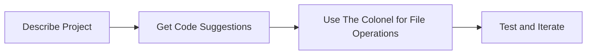

# Getting Started with UC-1

Welcome to UC-1! This guide will help you get productive with your personal AI command center in just a few minutes.

## First Login

After installation, UC-1 services are automatically running. Let's get you set up:

### 1. Access Open WebUI
Navigate to **http://localhost:8080** in your browser.

!!! tip "First User Becomes Admin"
    The first account you create will have administrator privileges. Choose your credentials carefully!

**Create Your Account:**
1. Click \"Sign Up\"
2. Enter your email and password
3. Click \"Create Account\"

You're now the admin of your UC-1 system! 🎉

### 2. Initial Configuration

#### Set Up Embedding Provider
For document intelligence and RAG features:

1. **Go to Settings** (⚙️ icon in top right)
2. **Navigate to**: Admin Settings → External Services
3. **Configure Embedding Provider**:
   - **Provider**: `OpenAI`
   - **Base URL**: `http://localhost:8001`
   - **API Key**: `not-required` (any value works)
   - **Model**: `nomic-embed-text-v1.5`
4. **Click Save**

#### Configure Default Model
Set your preferred language model:

1. **In Settings**: General → Interface
2. **Default Model**: Choose from available Ollama models
3. **Recommended**: `llama3.1:8b` (good balance of speed and capability)

### 3. Download Your First Model

UC-1 uses Ollama for local language models:

```bash
# Connect to Ollama container
docker exec -it unicorn-ollama ollama pull llama3.1:8b

# Or for more advanced tasks
docker exec -it unicorn-ollama ollama pull codellama:13b
```

Popular model recommendations:
- **llama3.1:8b** - Fast, general-purpose (4GB RAM)
- **llama3.1:70b** - More capable, slower (40GB+ RAM)
- **codellama:13b** - Programming tasks (8GB RAM)
- **phi3:mini** - Lightweight, fast (2GB RAM)

## Your First Conversations

### Basic Chat
1. **Start a New Chat** (+ icon or Ctrl+Shift+O)
2. **Type a message**: \"Hello! Tell me about UC-1.\"
3. **Press Enter** and watch your local AI respond

### Document Intelligence
Test UC-1's RAG (Retrieval Augmented Generation) capabilities:

1. **Upload a Document**:
   - Click the 📎 paperclip icon
   - Choose a PDF, text, or image file
   - Wait for processing (you'll see a progress indicator)

2. **Ask Questions**:
   - \"Summarize the key points in this document\"
   - \"What are the main conclusions?\"
   - \"Find information about [specific topic]\"

### Web Search Integration
UC-1 can search the web privately through SearXNG:

1. **Ask a Current Events Question**: \"What's the latest news about AI?\"
2. **Enable Web Search**: Click the 🌐 icon before sending
3. **Get Results**: UC-1 will search and synthesize information

## Meet The Colonel

The Colonel is your AI automation agent, accessible through Open WebUI's tool system:

### Activate The Colonel
1. **Click Tools** (🛠️ icon in chat interface)
2. **Select The Colonel** from available tools
3. **Give Automation Commands**:
   - \"Take a screenshot and analyze what's on my screen\"
   - \"List the files in my Downloads folder\"
   - \"Check my system's resource usage\"

### Example Automation Tasks
```
\"Create a summary report of all PDF files in my Documents folder\"

\"Take a screenshot, save it to Desktop, and tell me what applications are running\"

\"Check my internet connection speed and system performance\"

\"Help me organize my Downloads folder by file type\"
```

## Exploring Services

### SearXNG - Private Search
- **URL**: http://localhost:8888
- **Purpose**: Privacy-focused web search
- **Features**: No tracking, multiple search engines, customizable

### Documentation
- **URL**: http://localhost:8000
- **Purpose**: Complete system documentation (you're reading it now!)
- **Features**: Searchable, comprehensive guides and references

### API Endpoints
For developers and advanced users:
- **Ollama API**: http://localhost:11434
- **Embedding API**: http://localhost:8001
- **Qdrant Vector DB**: http://localhost:6333

## Common Workflows

### 1. Research and Analysis


**Example Process:**
1. Upload research papers or reports
2. Ask: \"What are the main themes across these documents?\"
3. Follow up: \"Search for recent developments in [identified theme]\"
4. Request: \"Create a comprehensive summary combining document insights with latest developments\"

### 2. Development Assistance


**Example Process:**
1. \"I'm building a Python web scraper for news articles\"
2. Get code suggestions and explanations
3. Use The Colonel: \"Create the project structure and save the code files\"
4. Test and refine with AI assistance

### 3. Content Creation


**Example Process:**
1. \"Help me write a blog post about local AI deployment\"
2. \"Search for current statistics on data privacy concerns\"
3. \"Generate an outline and draft content\"
4. \"Review and suggest improvements\"

## Customization Options

### Themes and Interface
1. **Settings → Interface**
2. **Choose Theme**: Light, Dark, or Auto
3. **Adjust Layout**: Sidebar, chat width, etc.

### Model Management
```bash
# List available models
docker exec -it unicorn-ollama ollama list

# Remove unused models
docker exec -it unicorn-ollama ollama rm model_name

# Update a model
docker exec -it unicorn-ollama ollama pull model_name
```

### Advanced Configuration
Edit configuration files:
```bash
# Main environment configuration
nano UC-1_Core/.env

# Restart services after changes
cd UC-1_Core && ./start.sh
```

## Performance Tips

### Memory Management
- **Monitor Usage**: `docker stats` to see container memory usage
- **Model Selection**: Use smaller models for faster responses
- **Cleanup**: Regularly remove unused models and documents

### GPU Optimization
```bash
# Check GPU utilization (AMD)
radeontop

# Monitor Vulkan usage
vulkaninfo | grep deviceName
```

### Storage Management
```bash
# Check UC-1 storage usage
du -sh UC-1_Core/
docker system df

# Clean up unused containers/images
docker system prune
```

## Troubleshooting Quick Fixes

### Services Not Responding
```bash
# Check service status
docker ps --filter \"name=unicorn-\"

# Restart specific service
docker restart unicorn-open-webui

# Restart all services
cd UC-1_Core && ./start.sh
```

### Slow Performance
1. **Check Model Size**: Switch to smaller model temporarily
2. **Monitor Resources**: `htop` or `docker stats`
3. **Restart Services**: Fresh start often helps
4. **Clear Cache**: Redis restart: `docker restart unicorn-redis`

### Can't Upload Documents
1. **Check File Size**: Large files take time to process
2. **Verify Format**: Supported: PDF, DOC, TXT, images
3. **Check Logs**: `docker logs unicorn-open-webui`
4. **Restart Tika**: `docker restart unicorn-tika`

## Next Steps

### Learn More
- **[RAG Setup Guide](rag-setup.md)**: Advanced document intelligence
- **[Agent Configuration](agents.md)**: Customize The Colonel
- **[API Reference](../api/embedding.md)**: For developers and integrations

### Join the Community
- **GitHub**: Report issues and contribute
- **Documentation**: Suggest improvements
- **Share**: Show off your UC-1 workflows!

## Quick Reference Card

| Task | Command/Action |
|------|----------------|
| **New Chat** | Ctrl+Shift+O or + icon |
| **Upload File** | 📎 paperclip icon |
| **Web Search** | 🌐 globe icon before sending |
| **Access Tools** | 🛠️ tools icon |
| **Settings** | ⚙️ gear icon (top right) |
| **Check Services** | `docker ps --filter \"name=unicorn-\"` |
| **View Logs** | `docker logs unicorn-[service]` |
| **Restart All** | `cd UC-1_Core && ./start.sh` |

---

**Congratulations! You're now ready to harness the full power of UC-1.** 🦄

*Remember: Your data stays local, your AI stays private, and your possibilities are unlimited.*

**Take Command. Conquer. Win.**