# 🦄 UC-1: Unicorn Commander Founders Edition

!!! tip "Welcome to UC-1 Documentation"
    Complete technical documentation for the UC-1 system - your local-first AI automation and inference platform.

---

## What is UC-1?

**UC-1** is the flagship hardware platform for **Unicorn Commander** - a revolutionary AI operating environment that puts privacy, performance, and control back in your hands. Think of it as your personal AI command center that runs entirely on your hardware.

### 🌟 Key Features

=== "🔒 Privacy First"
    - **100% Local Inference** - Your data never leaves your hardware
    - **No Cloud Dependencies** - Work offline, stay secure
    - **Zero Telemetry** - Complete privacy by design

=== "⚡ High Performance"
    - **AMD 8945HS + 780M iGPU** - Optimized for AI workloads
    - **96GB RAM** - Handle large models and datasets
    - **Vulkan Acceleration** - Native GPU performance

=== "🧠 AI-Powered"
    - **Local LLMs** - Run ChatGPT-class models locally
    - **The Colonel** - Your personal AI automation agent
    - **RAG Pipeline** - Search and analyze your documents
    - **Embedding Server** - High-performance vector generation

=== "🔧 Developer Ready"
    - **Open Source Stack** - Fully customizable and extensible
    - **Docker Architecture** - Easy deployment and scaling
    - **OpenAI APIs** - Compatible with existing tools
    - **Extension System** - Build your own integrations

---

## Quick Start

!!! abstract "Get Started in Minutes"
    ```bash
    # Clone the repository
    git clone https://github.com/Unicorn-Commander/UC-1.git
    cd UC-1
    
    # Run the installation script
    ./install_UC-1.sh
    
    # Services will start automatically!
    # - Open WebUI: http://localhost:8080
    # - SearXNG: http://localhost:8888
    # - Documentation: http://localhost:7911
    ```

---

## 🧱 Included Components

| Component | Purpose | Port | Status |
|-----------|---------|------|--------|
| **[Open WebUI](components/open-webui.md)** | Chat interface & tool server | 8080 | ✅ Production |
| **[The Colonel](components/the-colonel.md)** | AI automation agent | - | ✅ Production |
| **[Unicorn Embed](components/unicorn-embed.md)** | Embedding & reranking | 8001 | ✅ Production |
| **[SearXNG](components/searxng.md)** | Privacy-focused search | 8888 | ✅ Production |
| **[Qdrant](components/stack.md#qdrant)** | Vector database | 6333 | ✅ Production |
| **[Redis](components/stack.md#redis)** | Caching & sessions | 6379 | ✅ Production |
| **[PostgreSQL](components/stack.md#postgresql)** | Primary database | 5432 | ✅ Production |

---

## 🏗️ Architecture Overview

```mermaid
graph TB
    User[👤 User] --> WebUI[🌐 Open WebUI<br/>:8080]
    User --> Search[🔍 SearXNG<br/>:8888]
    User --> Docs[📚 Documentation<br/>:8000]
    
    WebUI --> Colonel[🧠 The Colonel<br/>Agent System]
    WebUI --> Embed[🔮 Unicorn Embed<br/>:8001]
    WebUI --> Vector[📊 Qdrant<br/>:6333]
    
    Colonel --> Tools[🛠️ System Tools]
    Colonel --> Files[📁 File Operations]
    Colonel --> Code[💻 Code Execution]
    
    Embed --> GPU[🎮 AMD 780M iGPU<br/>Vulkan Acceleration]
    Vector --> Redis[⚡ Redis Cache<br/>:6379]
    WebUI --> DB[🗄️ PostgreSQL<br/>:5432]
    
    Search --> Proxy[🌐 Optional Proxy<br/>BrightData]
```



---

## 🎯 Use Cases

### 🏢 For Enterprises
- **Private AI Deployment** - Keep sensitive data on-premises
- **Custom Automation** - Build workflows with The Colonel
- **Document Intelligence** - RAG search across company knowledge
- **Development Platform** - Test AI applications safely

### 🧑‍💻 For Developers
- **Local AI Testing** - No API costs or rate limits
- **Agent Development** - Build and test AI agents
- **Model Experimentation** - Try different models and configurations
- **Integration Platform** - Connect with existing tools

### 🔬 For Researchers
- **Offline Research** - Work without internet dependencies
- **Custom Models** - Load and test specialized models
- **Data Privacy** - Keep research data secure
- **Reproducible Results** - Consistent local environment

### 🦄 For Power Users
- **Personal AI Assistant** - Automate daily tasks
- **Knowledge Management** - Search and analyze personal documents
- **Creative Projects** - AI-powered content generation
- **Learning Platform** - Explore AI capabilities safely

---

## 🚀 What's Next?

!!! tip "Recommended First Steps"
    1. **[Installation Guide](installation/quick-start.md)** - Get UC-1 running
    2. **[Getting Started Guide](guides/getting-started.md)** - Learn the basics
    3. **[The Colonel Setup](guides/agents.md)** - Configure your AI agent
    4. **[RAG Configuration](guides/rag-setup.md)** - Set up document search

---

## 📖 Documentation Structure

<div class="grid cards" markdown>

-   :material-download:{ .lg .middle } **Installation**

    ---

    Complete installation guides, troubleshooting, and system requirements.

    [:octicons-arrow-right-24: Installation Guide](installation/quick-start.md)

-   :material-cog:{ .lg .middle } **Components**

    ---

    Detailed documentation for each component in the UC-1 stack.

    [:octicons-arrow-right-24: Component Docs](components/stack.md)

-   :material-api:{ .lg .middle } **API Reference**

    ---

    Complete API documentation for integrations and development.

    [:octicons-arrow-right-24: API Docs](api/embedding.md)

-   :material-school:{ .lg .middle } **Guides**

    ---

    Step-by-step guides for common tasks and advanced configurations.

    [:octicons-arrow-right-24: User Guides](guides/getting-started.md)

</div>

---

**Built by [Magic Unicorn Unconventional Technology & Stuff Inc.](about/magic-unicorn.md)** 🦄

*Take Command. Conquer. Win.*